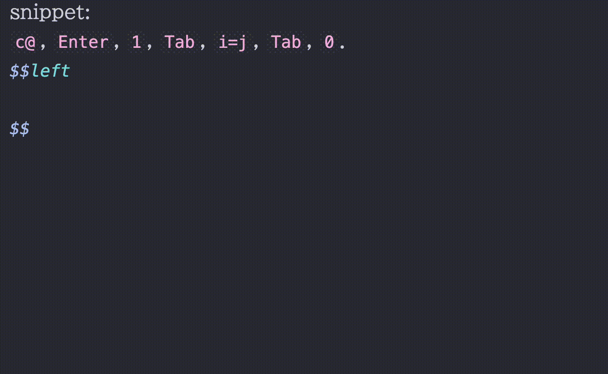

# Typst Mate

<a href="https://obsidian.md/">
  
</a>
<a href="https://typst.app/docs/changelog/">
  
</a>

> \* You may need to use tools like `resetprop` or directly edit `build.prop` to change `dalvik.vm.heapgrowthlimit` and `dalvik.vm.heapsize` to around `512m`. See [this warning](https://github.com/azyarashi/obsidian-typst-mate?tab=readme-ov-file#network).

Render math expressions in [Obsidian](https://obsidian.md) using [Typst](https://typst.app/) instead of MathJax.

[](#demo)

[](#symbol-suggest)

Snippet                  | Script
:-----------------------:|:------------------------:
[](#snippet) | [](#script-snippet)

For details about the processor / snippet(script) / shortcut / tab jump, see [Processor](docs/processor/) / [Snippet](docs/snippet/) / [Shortcut](docs/Shortcut.md) / [TabJump](docs/TabJump.md).

I welcome [Discussions](https://github.com/azyarashi/obsidian-typst-mate/discussions/categories/show-and-tell) featuring your wonderful snippets!

Are you an Obsidian LaTeX Suite user? Check out [this guide](docs/obsidian-latex-suite-migration.md).

If you want to use only typst codeblock? Check out [this issue](https://github.com/azyarashi/obsidian-typst-mate/issues/8).

> [!NOTE]
> For a smoother experience, some values are different from (or added to) standard Typst defaults. (e.g. `datetime`, `smallcaps`, `fontsize`, and `CURSOR`)
> See the [notes here](docs/processor#notes) for details.

---

## Features

- Support *inline math*, *display math*, and *code blocks*
- Support **preamble** and **templates** (called processors)
- **Linter**
- **`.typ` View**
- **Bracket Jump**
- **Typst Shortcut**
- **Snippets** / **Scripts**
- **Bracket highlights**
- **Symbol completion**
  - type a leading backslash `\` to make the search look for LaTeX commands
- **Inline math preview** / **Codeblock preview**
- **Available on mobile app**
- Offer **background rendering**
- Use **font size** from Obsidian settings
- Inherit **text color** from Obsidian theme
- **Additional styling customization**
  - e.g., an option `inline-middle` to vertically center *inline math* so it lines up naturally with the surrounding text
- Use **custom fonts** and import system fonts (desktop app only for import)
- Almost all[^1] **Typst packages** are supported (desktop app only for import local packages)
- **Table and blockquotes support** with proper display math handling (`<br>` and `\n[\s\t]*>` will be automatically replaced with line breaks)
- [Excalidraw](https://www.obsidianstats.com/plugins/obsidian-excalidraw-plugin) integration
- [Equation Citator](https://github.com/FRIEDparrot/obsidian-equation-citator) integration
- [No more flickering inline math](https://www.obsidianstats.com/plugins/inline-math) compatibility
- PDF Export, [Better Export PDF](https://www.obsidianstats.com/plugins/better-export-pdf), [Export Image plugin](https://www.obsidianstats.com/plugins/obsidian-export-image), and [Webpage HTML Export](https://www.obsidianstats.com/plugins/webpage-html-export) compatibility
- Typst Tools
  - Symbols viewer
  - Packages viewer
  - Snippets editor
  - Processors editor
  - Typst handwritten symbol recognition with [Detypify](https://github.com/QuarticCat/detypify)
  - Bidirectional converter between TeX/LaTeX and Typst with [TyLax](https://github.com/scipenai/tylax)
  - Commutative diagram editor with [Quiver](https://github.com/varkor/quiver)
- Context Menu
  - Copy as SVG (Obsidian Theme / Typst Default)
  - Copy as PNG (Transparent / Opaque)
  - Copy as img tag (for embedding into Obsidian notes)
- Support jump from click (experimental)
  - click codeblock output
  - click math output with <kbd>ctrl</kbd>

[^1]: [jlyfish](https://typst.app/universe/package/jlyfish/) probably won't work correctly.

For a better typing experience, I **strongly** recommend installing the [No more flickering inline math](https://www.obsidianstats.com/plugins/inline-math) plugin by [RyotaUshio](https://github.com/RyotaUshio):

Turned OFF               | Turned ON
:-----------------------:|:------------------------:
 | 

## Installation

Currently, it's under review for the official plugin list. This process may take several months.
Until then, please install using the official plugin [BRAT](https://obsidian.md/plugins?id=obsidian42-brat).

[](#install-with-brat)

## Compatibility

### Obsidian App

- PDF Export

### Other Plugins

- [Excalidraw](https://www.obsidianstats.com/plugins/obsidian-excalidraw-plugin) (use the `typst-render-to-excalidraw` command)
- [Equation Citator](https://github.com/FRIEDparrot/obsidian-equation-citator) (`Advanced Settings` > `Enable Typst Mode` > reload the plugin)
- [Markmind](https://www.obsidianstats.com/plugins/obsidian-markmind)
- [No more flickering inline math](https://www.obsidianstats.com/plugins/inline-math)
- [Better Export PDF](https://www.obsidianstats.com/plugins/better-export-pdf)
- [Export Image plugin](https://www.obsidianstats.com/plugins/obsidian-export-image)
- [Webpage HTML Export](https://www.obsidianstats.com/plugins/webpage-html-export) (don't forget to include CSS from Style Options and disable background rendering)

If the export doesn't work correctly, try disabling background rendering before exporting.

### Default Preamble

```typst
#set page(margin: 0pt, width: auto, height: auto)
#show raw: set text(1.25em)
#set text(size: fontsize)  // `fontsize` refers to the settings in Obsidian
#import "@preview/mannot:0.3.1": *
#import "@preview/quick-maths:0.2.1": shorthands
#show: shorthands.with(
  ($+-$, sym.plus.minus),
  ($|-$, math.tack),
)
// Typst 0.13.1 or before (plugin 2.1.7 or before)
// #let scr(it) = text(features: ("ss01",), box($cal(it)$))
```

### Custom Styling

You can apply your own custom CSS, not just the styling included in the plugin.
Depending on the three modes (`inline`, `display`, and `codeblock`), the styling method (`style`), and the identifier (`id`), the following CSS classes will be added:

- `typstmate-(mode)`
- `typstmate-style-(style)`
- `typstmate-id-(id)`

---

Typst Mate leverages the following open-source projects:

- [Typst](https://typst.app/) – a modern and powerful typesetting system
- [TyLax](https://github.com/scipenai/tylax) – a fast and high compatibility LaTeX to Typst converter
- [Detypify](https://github.com/QuarticCat/detypify) - a tool for recognizing handwritten math symbols
- [Quiver](https://github.com/varkor/quiver) - a tool for creating commutative diagrams

and contributors:

- [Merrkry](https://github.com/merrkry)

I'm grateful to the developers for making this plugin possible!

---

## Disclosures

This section contains wording required for publishing on Obsidian's official Community Plugins page, so I include it here.

### Network

This plugin makes use of a large WebAssembly (Wasm) binary.
Bundling it directly would significantly increase startup time, so it is automatically downloaded from the [Releases](https://github.com/azyarashi/obsidian-typst-mate/releases) page instead.

> [!WARNING]
> (Android devices only) Android imposes strict limits on heap size, which may cause crashes when loading WebAssembly. Resolving this requires a rooted device or [support from the Obsidian team](https://forum.obsidian.md/t/enable-largeheap-in-obsidian-android-app-to-avoid-ooms/108119) (please `+1`).

Network access is required to install Typst packages, and is also required by Typst Tools to display lists of packages and symbols and to use Detypify and Quiver.

### Reading Local Files (Desktop App only)

If the cache for a given package cannot be found inside the Vault, this plugin will fall back to accessing the same local package files used by the Typst CLI.
For the exact locations, see [typst/README.md#local-packages](https://github.com/typst/packages/blob/main/README.md#local-packages).

## Planned Update Contents

See [Discussion#10](https://github.com/azyarashi/obsidian-typst-mate/discussions/10).
